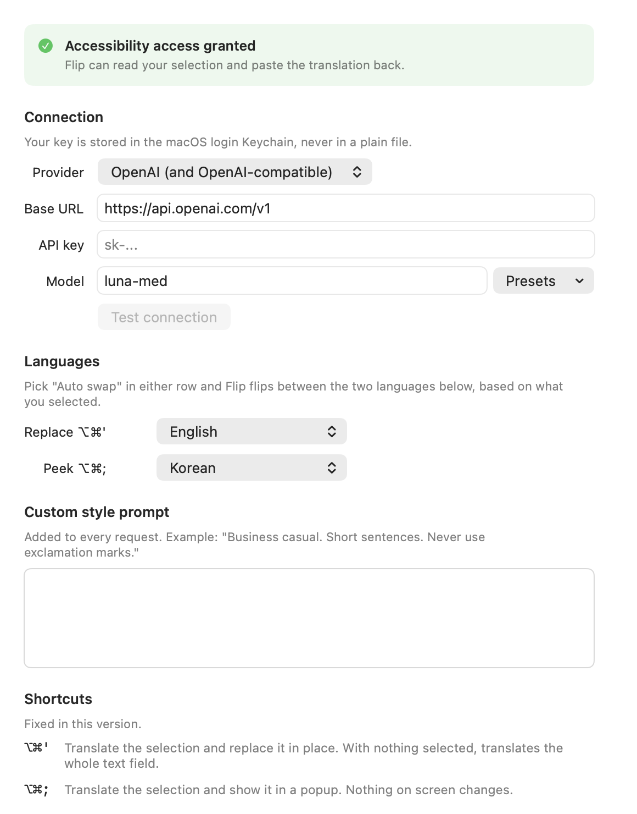
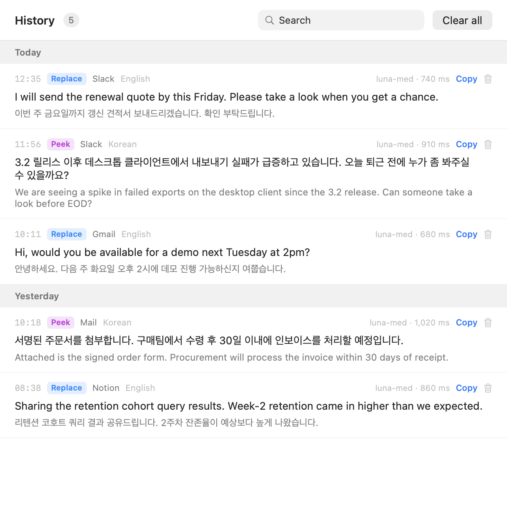
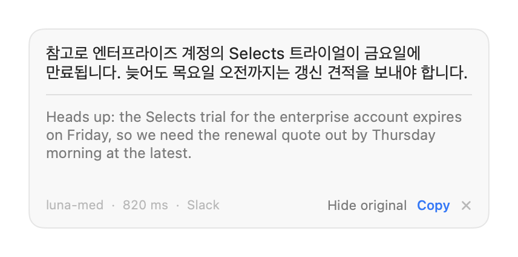
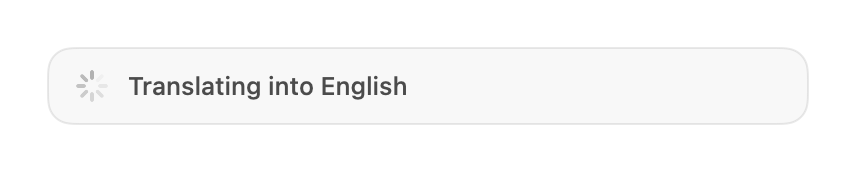

# Flip

A macOS menu bar app that translates the text you have selected, in any app, with a keyboard shortcut. No Electron, no dependencies, no telemetry: about 1,900 lines of Swift against system frameworks, and your API key stays in your own Keychain.

MIT licensed. Requires macOS 14 or later and the Xcode Command Line Tools.

```
git clone <this repo> && cd flip
./scripts/create-signing-identity.sh   # optional, stops repeated permission prompts
./scripts/build.sh
open build/Flip.app
```

Two shortcuts, two behaviours:

| Shortcut | What happens |
|---|---|
| `⌥⌘'` (option command apostrophe) | Translates your selection and **replaces it in place**. If nothing is selected, it translates the whole text field you are in. |
| `⌥⌘;` (option command semicolon) | Translates your selection and **shows it in a popup**. Nothing on screen is changed. |

The intended loop: write a Slack message in Korean, select it, press `⌥⌘'`, and the box now holds the English version. Read an English message, select it, press `⌥⌘;`, and a floating panel shows the Korean.

## Install

```
./scripts/build.sh
open build/Flip.app
```

The build needs no dependencies and no Xcode project. It uses the Swift compiler that ships with the Xcode Command Line Tools.

To keep it around, drag `build/Flip.app` into `/Applications`.

## First run: two things to set

**1. Accessibility permission.** macOS will ask on first launch. Open System Settings, go to Privacy & Security, then Accessibility, and turn Flip on. Without it the app cannot read your selection or paste the translation back.

If the build is signed ad hoc, every rebuild produces a different signature, macOS treats it as a different app, and it drops this permission and re-asks for your Keychain password. Run this once to stop that:

```
./scripts/create-signing-identity.sh
./scripts/build.sh
```

It puts a self-signed certificate called "Flip Dev" in your login Keychain and signs every build with it. The signature identity then stays the same across rebuilds, so both prompts stop. To undo it, delete "Flip Dev" in Keychain Access.

**2. API key.** Click the menu bar icon, choose Settings, pick your provider, and paste your key. The key is stored in the macOS login Keychain, not in a file. Press "Test connection" to confirm it works before relying on the shortcuts.

## Settings

- **Provider** — OpenAI (or anything that speaks the OpenAI chat completions format) or Anthropic.
- **Base URL** — prefilled per provider; change it to point at a compatible gateway.
- **Model** — free text, with presets per provider. Default is `luna-med`.
- **Replace shortcut translates into** — default English.
- **Peek shortcut translates into** — default Korean.
- **Auto swap** — pick this in either list and the app flips between your two configured languages based on what you selected.
- **Custom style prompt** — free text appended to every request. For example: *Business casual. Short sentences. Never use exclamation marks.*

## History

Menu bar icon, then History. Every translation is recorded: time, mode, source app, the original, the translation, the model, and how long the request took. Searchable, copyable, deletable.

Stored at `~/Library/Application Support/Flip/history.json`, on your machine only.

## When a shortcut does nothing

Run the built-in diagnostic. Quit the menu bar app first, otherwise the running copy already owns the shortcuts and the probe cannot tell that apart from another app owning them.

```
build/Flip.app/Contents/MacOS/Flip --doctor
```

It reports, and tells you how to fix, each of: Accessibility permission, whether each shortcut actually registered or is owned by another app, whether an API key is stored, the provider and model in use, and whether a menu bar manager such as Ice is hiding the status icon.

## Storing the key from the terminal

If a menu bar manager has hidden the icon, you do not need it:

```
build/Flip.app/Contents/MacOS/Flip --set-key
```

It prompts, reads one line from standard input so the key never reaches your shell history or the process list, and writes it to the login Keychain. An empty line clears the stored key.

Launching the app while it is already running also opens Settings, which is the other way past a hidden icon.

## Checking it without the interface

```
build/Flip.app/Contents/MacOS/Flip --prompt
build/Flip.app/Contents/MacOS/Flip --prompt --peek
build/Flip.app/Contents/MacOS/Flip --translate "안녕하세요, 오늘 회의는 3시입니다"
```

The first two print the exact system prompt that will be sent. The third runs one real translation and prints the result, the model, and the latency.

## How it reads and writes text

For the popup shortcut the app first asks macOS Accessibility for the selected text, which does not touch your clipboard. If that returns nothing, it falls back to a synthetic command+C.

For the replace shortcut it always uses the clipboard: it saves whatever you had, copies the selection, pastes the translation, then puts your original clipboard back. If a copy produces nothing, it sends command+A first, which is what makes "translate my whole input box" work.

## Giving it to other people

The self-signed certificate above is for your own machine only. It does not make the app distributable.

A Mac that downloads this app refuses to open it: Gatekeeper reports that Apple cannot verify the developer. Getting past that needs three things, and there is no way around them:

1. An Apple Developer Program membership, 99 US dollars per year.
2. A "Developer ID Application" certificate issued under that membership.
3. Notarization: the signed app is uploaded to Apple, scanned, and the returned ticket is stapled into the bundle.

There is no Developer ID certificate on this machine today (`security find-identity -v -p codesigning` returns nothing), so this is a purchase and setup step, not a code change. Once the certificate exists, the only change here is the identity name in `scripts/build.sh` plus a notarization step after it.

Until then there are two ways to hand it to someone, both awkward for a non-engineer:

- They clone the repository and run `./scripts/build.sh` themselves. A locally built app carries no quarantine flag, so it opens normally. It needs the Xcode Command Line Tools.
- You send them the built app and they right-click it and choose Open the first time, or run `xattr -d com.apple.quarantine /Applications/Flip.app`. Some managed Macs block this outright.

## How it is built

One `swiftc` invocation over `Sources/Flip/*.swift`, linked against AppKit, SwiftUI, Carbon, ApplicationServices and Security. There is no package manifest and no third-party code, so there is nothing to resolve or vendor.

| File | Responsibility |
|---|---|
| `Hotkeys.swift` | System-wide shortcuts through Carbon `RegisterEventHotKey`, and whether each one actually registered |
| `TextAccess.swift` | Reading the selection through Accessibility or a synthetic copy, and pasting the result back |
| `Translator.swift` | The prompt, and the OpenAI and Anthropic request shapes |
| `Settings.swift`, `Keychain.swift` | Configuration, and the API key in the login Keychain |
| `HistoryStore.swift`, `HistoryView.swift` | The record of every translation |
| `PopupPanel.swift` | The floating panel, which must never take focus from the app you are typing in |
| `Doctor.swift` | `--doctor`, which reports every precondition the shortcuts depend on |

## Limits in this version

- macOS only. Windows is planned; the translation, settings, and history layers are platform independent, only text reading, pasting, and hotkeys would need a Windows implementation.
- Shortcuts are fixed. There is no recorder yet.
- 8,000 characters per translation.
- No streaming. The popup shows a spinner until the whole translation arrives.

## Screenshots

Rendered from the app itself with `Flip --screenshot docs/`:

| | |
|---|---|
|  |  |
|  |  |
